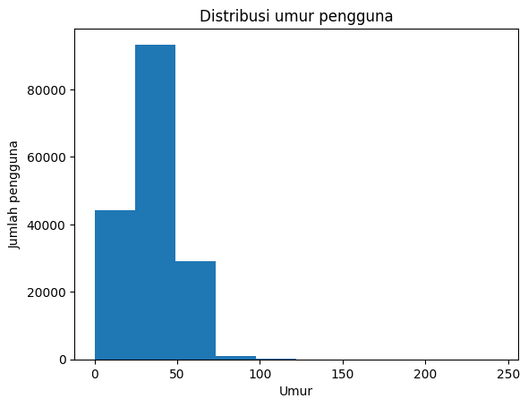
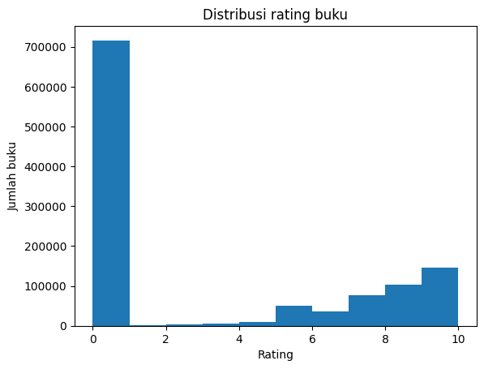

# Laporan Proyek Machine Learning - Mohamed

## Project Overview

Perkembangan teknologi informasi yang pesat telah mendorong digitalisasi di berbagai bidang, termasuk dalam dunia literasi dan perbukuan. Saat ini, banyak platform digital yang menyediakan ribuan hingga jutaan judul buku dalam berbagai genre, yang tentunya dapat membingungkan pengguna dalam memilih bacaan yang sesuai dengan minat dan kebutuhannya. Dalam konteks inilah sistem rekomendasi memiliki peran penting sebagai alat bantu untuk menyaring informasi dan memberikan saran personalisasi kepada pengguna.

Dilansir dari situs statista, penjualan ebooks atau buku elektronik dan audiobook meningkat secara signifikan dari tahun ke tahun dan diperkirakan akan terus meningkat hingga tahun 2029 yang menunjukkan pertumbuhan positif dan meningkatnya minat baca masyarakat di indonesia[1][2].

Sistem rekomendasi telah menjadi komponen utama dalam berbagai layanan digital seperti e-commerce, layanan streaming, hingga perpustakaan digital. Maka dari itu diperlukan pengembangan sistem rekomendasi yang dapat membantu meningkatkan penjualan buku baik itu ebook ataupun audiobook dengan memberikan rekomendasi yang relevan sesuai dengan preferensi dari pelanggan.

Sistem rekomendasi yang dibuat akan menggunakan dua pendekatan, yaitu collaborative filtering dan content-based filtering
penelitian terdahulu menunjukkan bahwa penerapan sistem rekomendasi untuk penjualan buku terbukti berhasil dalam meningkatkan jumlah penjualan buku secara signifikan [3][4].

### Referensi

[1] Statista, "Audiobooks - Indonesia," [Online]. Available: https://www.statista.com/outlook/amo/media/books/audiobooks/indonesia. [Accessed: 29-May-2025].

[2] Statista, "E-books - Indonesia," [Online]. Available: https://www.statista.com/outlook/amo/media/books/ebooks/indonesia. [Accessed: 29-May-2025].

[3] Kurmashov, N., Latuta, K., & Nussipbekov, A. (2015, September). Online book recommendation system. In 2015 Twelve International Conference on Electronics Computer and Computation (ICECCO) (pp. 1-4). IEEE.

[4] Rajpurkar, S., Bhatt, D., Malhotra, P., Rajpurkar, M. S. S., & Bhatt, M. D. R. (2015). Book recommendation system. International Journal for Innovative Research in Science & Technology, 1(11), 314-316.


--------

## Business Understanding

### Problem Statements
- pendekatan manakah yang lebih efektif dalam membuat sistem rekomendasi ? apakah menggunakan collaborive filtering atau content-based filtering ?
- metrik apa saja yang akan digunakan dalam mengukur performa dari dua sistem rekomendasi ?
- apa saja kekurangan dan kelebihan dari sistem rekomendasi berdasarkan pendekatan collaborative filtering dan content-based filtering ? 

### Goals
- Untuk membuat sistem rekomendasi berdasarkan teknik collaborative filtering dan content-based filtering.
- Untuk mencari sistem rekomendasi terbaik berdasarkan pengukuran performa menggunakan metrik precision@k dan recall@k.
- Untuk mengetahui kekurangan dan kelebihan dari sistem rekomendasi berdasarkan pendekatan collaborative filtering dan content-based filtering.

### Solution statements
- Membuat dua model sistem rekomendasi menggunakan LightFM.
- Membandingkan efektivitas kedua model menggunakan metrik pengukuran seperti precision@k dan recall@k.
- Melakukan evaluasi berdasarkan hasil pengukuran metrik untuk menentukan kelebihan serta kekurangan dari kedua model.

## Data Understanding
Dataset yang digunakan dalam proyek kali ini berasal dari kaggle, yaitu [Book Recommendation Dataset by Möbius - kaggle](https://www.kaggle.com/datasets/arashnic/book-recommendation-dataset). Terdapat 3 file dataset didalamnya berikut adalah daftar file-file dibawah ini : 

#### 1. Books.csv
- Jumlah baris : 271360 sampel data
- Jumlah kolom : 8 kolom 
- Kondisi data : 
  - Jumlah missing value : 7
  - Jumlah duplicate value : 0
- Daftar kolom atau fitur :
    1. ISBN : merupakan ISBN dari buku
    2. Book-Title : merupakan judul dari buku
    3. Book-Author : merupakan nama lengkap dari penulis
    4. Year-Of-Publication : merupakan tahun suatu buku diterbitkan
    5. Publisher : merupakan nama penerbit
    6. Image-URL-S : Thumbnail cover buku dalam ukuran kecil (S), menggunakan amazon link
    7. Image-URL-M : Thumbnail cover buku dalam ukuran sedang (M), menggunakan amazon link
    8. Image-URL-L : Thumbnail cover buku dalam ukuran besar (L), menggunakan amazon link
- Struktur data
    ```python
    <class 'pandas.core.frame.DataFrame'>
    RangeIndex: 271360 entries, 0 to 271359
    Data columns (total 8 columns):
     #   Column               Non-Null Count   Dtype 
    ---  ------               --------------   ----- 
     0   ISBN                 271360 non-null  object
     1   Book-Title           271360 non-null  object
     2   Book-Author          271358 non-null  object
     3   Year-Of-Publication  271360 non-null  object
     4   Publisher            271358 non-null  object
     5   Image-URL-S          271360 non-null  object
     6   Image-URL-M          271360 non-null  object
     7   Image-URL-L          271357 non-null  object
    dtypes: object(8)
    memory usage: 16.6+ MB
    ```

#### 2. Users.csv
- Jumlah baris : 340556 sampel data
- Jumlah kolom : 3 kolom 
- Kondisi data : 
  - Jumlah missing value : 110762
  - Jumlah duplicate value : 0
- Daftar kolom atau fitur :
    1. User-ID : merupakan ID unik dari user
    2. Location : merupakan tempat tinggal atau lokasi dimana user berada
    3. Age : merupakan nilai umur dari user
- Struktur data
    ```python
    <class 'pandas.core.frame.DataFrame'>
    RangeIndex: 278858 entries, 0 to 278857
    Data columns (total 3 columns):
     #   Column    Non-Null Count   Dtype  
    ---  ------    --------------   -----  
     0   User-ID   278858 non-null  int64  
     1   Location  278858 non-null  object 
     2   Age       168096 non-null  float64
    dtypes: float64(1), int64(1), object(1)
    memory usage: 6.4+ MB
    ```

    
#### 3. Ratings.csv
- Jumlah baris : 1149780 sampel data
- Jumlah kolom : 3 kolom 
- Kondisi data : 
  - Jumlah missing value : 0
  - Jumlah duplicate value : 0
- Daftar kolom atau fitur :
    1. User-ID : merupakan ID unik dari user
    2. ISBN : merupakan ISBN dari buku
    3. Book-Rating : merupakan rating dari suatu buku dalam rentang 0-10
- Struktur data
    ```python
    <class 'pandas.core.frame.DataFrame'>
    RangeIndex: 1149780 entries, 0 to 1149779
    Data columns (total 3 columns):
     #   Column       Non-Null Count    Dtype 
    ---  ------       --------------    ----- 
     0   User-ID      1149780 non-null  int64 
     1   ISBN         1149780 non-null  object
     2   Book-Rating  1149780 non-null  int64 
    dtypes: int64(2), object(1)
    memory usage: 26.3+ MB
    ```

Terdapat beberapa file dataset yang memiliki missing value, mulai dari skala terkecil seperti pada file Books.csv sebanyak 7 hingga skala terbesar seperti pada  file Users.csv sebanyak 110762 , maka perlu untuk melihat distribusi dari data setiap fitur data agar dapat menentukan metode imputasi nilai null yang tepat.

## Exploratory Data Analysis (EDA)

### ratings_df
#### Jumlah Data Null

| Kolom                 | Jumlah Null |
|-----------------------|--------------|
| User-ID               | 0            |
| ISBN                  | 0            |
| Book-Rating           | 0            |

#### Statistik deskriptif

| Statistic | User-ID       | ISBN       | Book-Rating  |
|-----------|---------------|------------|--------------|
| count     | 1,149,780     | 1,149,780  | 1,149,780    |
| unique    | NaN           | 340,556    | NaN          |
| top       | NaN           | 0971880107 | NaN          |
| freq      | NaN           | 2,502      | NaN          |
| mean      | 140,386.4     | NaN        | 2.867        |
| std       | 80,562.3      | NaN        | 3.854        |
| min       | 2             | NaN        | 0            |
| 25%       | 70,345        | NaN        | 0            |
| 50%       | 141,010       | NaN        | 0            |
| 75%       | 211,028       | NaN        | 7            |
| max       | 278,854       | NaN        | 10           |


#### Jumlah Data Duplikat

Jumlah Dataset Duplikat : 0  

------------------

### Books.csv
#### Jumlah Data Null

| Kolom                 | Jumlah Null |
|-----------------------|--------------|
| ISBN                  | 0            |
| Book-Title            | 0            |
| Book-Author           | 2            |
| Year-Of-Publication   | 0            |
| Publisher             | 2            |
| Image-URL-S           | 0            |
| Image-URL-M           | 0            |
| Image-URL-L           | 3            |

#### Statistik deskriptif
| Statistic            | ISBN      | Book-Title     | Book-Author     | Year-Of-Publication | Publisher   | Image-URL-S                                       | Image-URL-M                                       | Image-URL-L                                       |
|----------------------|-----------|----------------|------------------|----------------------|-------------|---------------------------------------------------|---------------------------------------------------|---------------------------------------------------|
| count                | 271360    | 271360         | 271358           | 271360               | 271358      | 271360                                            | 271360                                            | 271357                                            |
| unique               | 271360    | 242135         | 102022           | 202                  | 16807       | 271044                                            | 271044                                            | 271041                                            |
| top                  | 020130998X| Selected Poems | Agatha Christie  | 2002                 | Harlequin   | http://images.amazon.com/images/P/042509474X.0... | http://images.amazon.com/images/P/042509474X.0... | http://images.amazon.com/images/P/006091985X.0... |
| freq                 | 1         | 27             | 632              | 13903                | 7535        | 2                                                 | 2                                                 | 2                                                 |


#### Jumlah Data Duplikat

Jumlah Dataset Duplikat : 0  

------------------


### Users_df

#### Jumlah Data Null

| Kolom                 | Jumlah Null  |
|-----------------------|--------------|
| User-ID               | 0            |
| Location              | 0            |
| Age                   | 110762       |

#### Statistik deskriptif

| Statistic | User-ID       | Location                          | Age        |
|-----------|---------------|-----------------------------------|------------|
| count     | 278858.00000  | 278858                            | 168096.000 |
| unique    | NaN           | 57339                             | NaN        |
| top       | NaN           | london, england, united kingdom   | NaN        |
| freq      | NaN           | 2506                              | NaN        |
| mean      | 139429.50000  | NaN                               | 34.751434  |
| std       | 80499.51502   | NaN                               | 14.428097  |
| min       | 1.00000       | NaN                               | 0.000000   |
| 25%       | 69715.25000   | NaN                               | 24.000000  |
| 50%       | 139429.50000  | NaN                               | 32.000000  |
| 75%       | 209143.75000  | NaN                               | 44.000000  |
| max       | 278858.00000  | NaN                               | 244.000000 |


#### Jumlah Data Duplikat

Jumlah Dataset Duplikat : 0  

Ditemukan 110762 missing value pada kolom Age 

------------------


### Visualisasi distribusi umur pelanggan


```python
users_df['Age'].skew()
```

Distribusi data pada kolom Age cenderung *right skew*, dibuktikan dengan nilai skew sebesar 1.178391610309946

### Visualisasi distribusi rating dari pelanggan


```python
ratings_df['Book-Rating'].skew()
```

Terdapat ketidakseimbangan dalam distribusi nilai , dimana rating 0 berjumlah 700 ribu mendominasi data rating lain. hal tersebut membuat distribusi data menjadi cenderung ke *right skew* dibuktikan dengan nilai skewness sebesar 0.733641207848559, sehingga agar dapat menyeimbangkan nilainya data dari rating 0 perlu dihapus.

### tabel top 5 tahun dengan jumlah penerbitan buku terbanyak

| Year-Of-Publication       | count  |
|---------------------------|--------|
| 2002	                    | 13903  |  
| 2001	                    | 13715  |
| 1999                      | 13414  |
| 2000	                    | 13373  |
| 1998	                    | 12116  |

Tahun 2002 menjadi tahun dimana banyak buku yang dipublikasikan , dibuktikan dengan jumlah publikasi terbanyak pada angka 919 buku, disusul dengan tahun 2001  dengan buku yang dipublikasikan sebanyak 8115 buku, tahun 2000 dengan buku yang dipublikasikan sebanyak 787 buku, tahun 2003  dengan buku yang dipublikasikan sebanyak 731, dan tahun 1999 dengan buku yang dipublikasikan sebanyak	728 buku.


### tabel top 5 penerbit dengan jumlah penerbitan buku terbanyak

| Publisher	               | count  |
|--------------------------|--------|
| Ballantine Books	       |  299   |  
| Pocket	                 |  256   |
| Berkley Publishing Group |	235   |
| Warner Books	           |  206   |
| Bantam Books	           |  204   |

Ballantine Books merupakan Publisher urutan teratas dalam hal penerbitan buku, terdapat 300 buku yang telah diterbitkan olehnya, di bawahnya adalah Pocket dengan 255 buku yang diterbitkan, dibawahnya lagi ada Berkley Publishing Group dengan 232 buku yang diterbitkan, dibawahnya lagi ada Warner Books dengan 203 buku yang diterbitkan, dan dibawahnya lagi ada Bantams Books dengan 202 buku yang diterbitkan.


### Hasil Akhir

1.   Pada file ratings.csv, terdapat total 1149780 baris data dengan 3 kolom data, tidak terdapat missing value dan tidak memiliki data duplikat sehingga tidak dibutuhkan tindakan imputasi nilai maupun penghapusan nilai duplikat.

2.   Pada file books.csv, terdapat total 271360 baris data dengan 8 kolom data, tidak terdapat missing value namun terdapat 7 data duplikat sehingga perlu untuk menghapus data duplikat tersebut.

3.   Distribusi data pada kolom Age cenderung *right skew*, dibuktikan dengan nilai skew sebesar 1.178391610309946. ditemukan sebanyak 110762 missing value dari kolom Age sehingga dibutuhkan imputasi data menggunakan nilai median hal ini merujuk kepada distribusi data
dari kolom Age itu sendiri.

4. Distribusi data pada kolom Book-Rating cenderung lebih ke arah kanan atau positive-skew dibuktikan dengan nilai skewness sebesar 0.733641207848559, hal ini dikarenakan ketidakseimbangan nilai pada rating 0 yang berjumlah 700.000 sedangkan rating 1 hingga 10 berada di bawah rentang tersebut. hal yang perlu dilakukan adalah dengan menghapus data rating 0 dari kolom Book-Rating agar mengatasi kejomplangan dalam jumlah data.

5.  Pada file users.csv, terdapat total 278858 baris data dengan 3 kolom data, terdapat 110762 missing value pada kolom age namun tidak memiliki data duplikat sehingga diperlukan imputasi data terhadap kolom age menggunakan nilai median dari kolom age dikarenakan distribusi data dari kolom age yang cenderung *right skew* dibuktikan dengan nilai *skewness* sebesar 1.17 yang menandakan bahwa distribusi data cenderung mengalami *skewness*

6. Tahun 2002 menjadi tahun dimana banyak buku yang dipublikasikan , dibuktikan dengan jumlah publikasi terbanyak pada angka 919 buku, disusul dengan tahun 2001  dengan buku yang dipublikasikan sebanyak 8115 buku, tahun 2000 dengan buku yang dipublikasikan sebanyak 787 buku, tahun 2003  dengan buku yang dipublikasikan sebanyak 731, dan tahun 1999 dengan buku yang dipublikasikan sebanyak	728 buku.

7. Ballantine Books merupakan Publisher urutan teratas dalam hal penerbitan buku, terdapat 300 buku yang telah diterbitkan olehnya, di bawahnya adalah Pocket dengan 255 buku yang diterbitkan, dibawahnya lagi ada Berkley Publishing Group dengan 232 buku yang diterbitkan, dibawahnya lagi ada Warner Books dengan 203 buku yang diterbitkan, dan dibawahnya lagi ada Bantams Books dengan 202 buku yang diterbitkan.


## Data Preparation

### Menghapus data anomali pada kolom Year-of-Publication dalam DataFrame books_df berupa tahun ke-0 
```python
books_df = books_df[books_df['Year-Of-Publication'] != 0]
```
Berhasil menghapus data anomali berupa tahun ke 0 dari DataFrame books_df pada kolom Year-Of-Publication

### Melakukan imputasi data pada kolom Age dengan nilai median
```python
users_df.fillna(users_df['Age'].median() , inplace=True)
```
Imputasi data pada kolom age menggunakan nilai median dilakukan dikarenakan distribusi data dari kolom age yang cenderung *right skew* 

### Menghapus nilai duplikat dari DataFrame books_df
```python
books_df.drop_duplicates(inplace=True)
```
Penghapusan dari nilai duplikat dalam DataFrame books_df dilakukan dikarenakan jumlah data duplikat yang sedikit dan tidak berpengaruh secara signifikan bilamana dihapus serta membuat data menjadi lebih bersih dan siap untuk dijadikan data latih untuk model.

### Menghapus kolom yang tidak diperlukan pada DataFrame books_df
```python
books_df.drop(['Image-URL-S' , 'Image-URL-M' , 'Image-URL-L'], inplace=True , axis=1)
```
Penghapusan kolom 'Image-URL-S' , 'Image-URL-M' , 'Image-URL-L' dilakukan dikarenakan ketiga kolom tersebut tidak dibutuhkan dan tidak digunakan dalam melatih model.

### Menyaring data dari kolom Book-Rating
```python
ratings_df = ratings_df[ratings_df['Book-Rating'] >= 1]
```
Menyaring data dari DataFrame ratings_df pada kolom Book-Rating untuk mengambil rating sama dengan atau lebih dari 1 untuk menghindari noise pada data latih dan menghindari distorsi pada model.


### Melakukan sampling data sebanyak 10001 untuk masing-masing DataFame
```python
users_df = users_df[:10001]
books_df = books_df[:10001]
ratings_df = ratings_df[:10001]
```
Pembatasan data hingga 10001 pada setiap DataFrame dilakukan untuk mempercepat proses pelatihan model  serta menghemat sumber daya.


### Merging DataFrame ratings_df , users_df , dan books_df
```python
merged_df = pd.merge(ratings_df , users_df , on='User-ID')
merged_df = pd.merge(merged_df , books_df , on='ISBN')

merged_df.head()
```
Merge data ini dilakukan biar semua info penting—rating, data user, dan detail buku—nyatu di satu DataFrame. Jadi, model bisa belajar pola dari hubungan antar user dan buku secara lebih lengkap, cocok buat sistem rekomendasi, baik collaborative maupun content-based.

### Melakukan proses encoding menggunakan OneHotEncoder() pada DataFrame merged_df pada kolom [ 'Book-Title', 'Book-Author', 'Year-Of-Publication', 'Publisher']
```python
items_df = merged_df[['Book-Title', 'Book-Author', 'Year-Of-Publication', 'Publisher']] 
encoder = OneHotEncoder()
encoded_df = encoder.fit_transform(items_df)
```
Proses encoding data pada merged_df dilakukan agar dapat memudahkan model dalam menemukan pola tersembunyi pada data serta mempercepat konvergensi model

### Menyiapkan data latih untuk model sistem rekomendasi dengan teknik Collaborative Filtering
```python
dataset1 = Dataset()
dataset1.fit(merged_df['User-ID'] , merged_df['ISBN'])

(interactions_1, weights_1) = dataset1.build_interactions([(row['User-ID'], row['ISBN'], row['Book-Rating']) for _, row in merged_df.iterrows()])
```
fitting pada dataset1 menggunakan data pada kolom User-ID dan ISBN dilakukan untuk membuat dataset yang nantinya akan digunakan dalam proses pelatihan pada model sistem rekomendasi collaborative filtering

### Menyiapkan data latih untuk model sistem rekomendasi dengan teknik Content-Based Filtering
```python
item_features_list = [
    (row['ISBN'],[row['Book-Title'] , row['Book-Author'], row['Year-Of-Publication'], row['Publisher']])
    for _, row in merged_df.iterrows()
]

dataset2 = Dataset()
all_features = pd.unique(
    merged_df[['Book-Title', 'Book-Author', 'Year-Of-Publication', 'Publisher']]
    .values
    .ravel()
)
dataset2.fit(merged_df['User-ID'] , merged_df['ISBN'])
dataset2.fit_partial(items=merged_df['ISBN'] , item_features =  all_features)

item_features = dataset2.build_item_features(item_features_list)

(interactions_2, weights_2) = dataset2.build_interactions([(row['User-ID'], row['ISBN'], row['Book-Rating']) for _, row in merged_df.iterrows()])
```
fitting pada dataset2 menggunakan data pada kolom User-ID dan ISBN dan fit_partial pada dataset2 menggunakan data buku melalui perantara kolom ISBN dilakukan untuk membuat dataset yang nantinya akan digunakan dalam proses pelatihan pada model sistem rekomendasi content-based filtering

### Hasil Akhir

1. Berhasil menghapus data anomali berupa tahun ke 0 dari DataFrame books_df pada kolom Year-Of-Publication
2. Imputasi data pada kolom age menggunakan nilai median dilakukan dikarenakan distribusi data dari kolom age yang cenderung *right skew* 
3. Penghapusan dari nilai duplikat dalam DataFrame books_df dilakukan dikarenakan jumlah data duplikat yang sedikit dan tidak berpengaruh secara signifikan bilamana dihapus serta membuat data menjadi lebih bersih dan siap untuk dijadikan data latih untuk model.
4. Penghapusan kolom 'Image-URL-S' , 'Image-URL-M' , 'Image-URL-L' dilakukan dikarenakan ketiga kolom tersebut tidak dibutuhkan dan tidak digunakan dalam melatih model.
5. Menyaring data dari DataFrame ratings_df pada kolom Book-Rating untuk mengambil rating sama dengan atau lebih dari 1 untuk menghindari noise pada data latih dan menghindari distorsi pada model.
6. Pembatasan data hingga 10001 pada setiap DataFrame dilakukan untuk mempercepat proses pelatihan model  serta menghemat sumber daya.
7. Merge data ini dilakukan biar semua info penting—rating, data user, dan detail buku—nyatu di satu DataFrame. Jadi, model bisa belajar pola dari hubungan antar user dan buku secara lebih lengkap, cocok buat sistem rekomendasi, baik collaborative maupun content-based.
8. Proses encoding data pada merged_df dilakukan agar dapat memudahkan model dalam menemukan pola tersembunyi pada data serta mempercepat konvergensi model
9. fitting pada dataset1 menggunakan data pada kolom User-ID dan ISBN dilakukan untuk membuat dataset yang nantinya akan digunakan dalam proses pelatihan pada model sistem rekomendasi collaborative filtering
10. fitting pada dataset2 menggunakan data pada kolom User-ID dan ISBN dan fit_partial pada dataset2 menggunakan data buku melalui perantara kolom ISBN dilakukan untuk membuat dataset yang nantinya akan digunakan dalam proses pelatihan pada model sistem rekomendasi content-based filtering


## Modeling
### Collaborative Filtering (LightFM + WARP-KOS)
Model ini menggunakan interaksi historis antara pengguna dan buku dalam bentuk implicit feedback (misalnya rating), tanpa menggunakan informasi konten buku. LightFM digunakan sebagai algoritma dengan loss function WARP-KOS yang mengutamakan performa ranking.

$$\hat{r}_{u,i} = \mathbf{p}_u^\top \mathbf{q}_i + b_u + b_i$$

**Keterangan:**

* $\hat{r}_{u,i}$ = skor prediksi untuk interaksi antara user $u$ dan item $i$
* $\mathbf{p}_u$ = vektor representasi laten untuk user $u$
* $\mathbf{q}_i$ = vektor representasi laten untuk item $i$
* $b_u$ = bias untuk user $u$
* $b_i$ = bias untuk item $i$

---

Loss function WARP-KOS (Weighted Approximate-Rank Pairwise - k-Order Statistic):

}\log\sigma(\hat{r}_{u,i}-\hat{r}_{u,j}))


**Keterangan:**

* $\mathcal{L}$ = total loss yang diminimalkan selama training
* $\sigma$ = fungsi sigmoid
* $\hat{r}_{u,i}$ = skor prediksi user $u$ terhadap item positif $i$
* $\hat{r}_{u,j}$ = skor prediksi user $u$ terhadap item negatif $j$
* $i \in \text{positive items}$, $j \in \text{negative samples}$

WARP-KOS bekerja dengan men-sampling item negatif $j$ hingga ditemukan satu yang skor prediksinya lebih tinggi dari item positif $i$, lalu menghitung loss berdasarkan perbedaan skor.

#### Kelebihan

* Efektif untuk data dengan interaksi yang sparse
* Tidak memerlukan metadata atau fitur konten tambahan
* Fokus pada peningkatan ranking item relevan

#### Kekurangan

* Tidak dapat menangani cold-start item atau user baru
* Bergantung pada interaksi historis yang cukup untuk performa optimal


#### sintaks

```python
model1 = LightFM(loss='warp-kos')
%time model1.fit(interactions_1, epochs=150 , num_threads=4)
```

* `loss='warp-kos'`: Mengatur fungsi loss ke **WARP-kos** yang memperhitungkan popularitas item untuk optimasi ranking.
* `interactions_2` : adalah matriks yang menunjukkan interaksi antara pengguna dan item.
* `epochs=150`: Menentukan jumlah **iterasi pelatihan sebanyak 150 kali** terhadap seluruh dataset.
* `num_threads=4`: Menentukan jumlah **thread paralel sebanyak 4** untuk mempercepat proses pelatihan.


---

### Content-Based Filtering (LightFM + WARP-KOS)

Model ini juga menggunakan LightFM dengan WARP-KOS, namun ditambahkan fitur konten dari item seperti judul, penulis, atau kategori buku. Fitur-fitur ini digunakan untuk membuat representasi tambahan item sehingga memungkinkan sistem merekomendasikan buku berdasarkan kemiripan konten.

$$ \hat{r}_{u,i} = \mathbf{p}_u^\top \mathbf{q}_i + b_u + b_i $$

**Keterangan:**

* $\hat{r}_{u,i}$ = skor prediksi untuk interaksi antara user $u$ dan item $i$
* $\mathbf{p}_u$ = vektor representasi laten untuk user $u$
* $\mathbf{q}_i$ = vektor representasi laten untuk item $i$
* $b_u$ = bias untuk user $u$
* $b_i$ = bias untuk item $i$

---

Loss function WARP-KOS (Weighted Approximate-Rank Pairwise - k-Order Statistic):

}\log\sigma(\hat{r}_{u,i}-\hat{r}_{u,j}))


**Keterangan:**

* $\mathcal{L}$ = total loss yang diminimalkan selama training
* $\sigma$ = fungsi sigmoid
* $\hat{r}_{u,i}$ = skor prediksi user $u$ terhadap item positif $i$
* $\hat{r}_{u,j}$ = skor prediksi user $u$ terhadap item negatif $j$
* $i \in \text{positive items}$, $j \in \text{negative samples}$

WARP-KOS bekerja dengan men-sampling item negatif $j$ hingga ditemukan satu yang skor prediksinya lebih tinggi dari item positif $i$, lalu menghitung loss berdasarkan perbedaan skor.


#### Kelebihan

* Dapat memberikan rekomendasi untuk item baru (cold-start)
* Tidak bergantung pada interaksi antar pengguna
* Dapat menjelaskan alasan rekomendasi karena berdasarkan fitur nyata

#### Kekurangan

* Bergantung pada kualitas dan kelengkapan data konten
* Rentan terhadap overspecialization jika fitur terlalu terbatas

#### sintaks

```python
model2 = LightFM(loss='warp-kos')
%time model2.fit(interactions_2, epochs=150 , num_threads=4, item_features=encoded_df)
```

* `loss='warp-kos'`: Mengatur fungsi loss ke **WARP-kos** yang memperhitungkan popularitas item untuk optimasi ranking.
* `interactions_2` : adalah matriks yang menunjukkan interaksi antara pengguna dan item.
* `epochs=150`: Menentukan jumlah **iterasi pelatihan sebanyak 150 kali** terhadap seluruh dataset.
* `num_threads=4`: Menentukan jumlah **thread paralel sebanyak 4** untuk mempercepat proses pelatihan.
* `item_features=encoded_df`: Menyediakan **fitur tambahan dari item** yang sudah di-encode dalam `encoded_df` untuk digunakan dalam pelatihan model.


---
#### Top-5 Recommendation Output

> Output yang diberikan dibawah merupakan rekomendasi yang diberikan oleh sistem untuk pelanggan dengan user_id = 730

> Correlative filtering model

|index|ISBN|Book-Title|Book-Author|Year-Of-Publication|Publisher|
|---|---|---|---|---|---|
|19|0452264464|Beloved \(Plume Contemporary Fiction\)|Toni Morrison|1994|Plume|
|101|0446677450|Rich Dad, Poor Dad: What the Rich Teach Their Kids About Money--That the Poor and Middle Class Do Not\!|Robert T\. Kiyosaki|2000|Warner Books|
|4729|068480087X|POSTCARDS|Annie Proulx|1994|Scribner|
|5027|0060086246|Last Chance Saloon|Marian Keyes|2003|Perennial|
|6145|0140181903|The Custom of the Country \(Penguin Twentieth-Century Classics\)|Edith Wharton|1990|Penguin Books|

> Content-based filtering model

|index|ISBN|Book-Title|Book-Author|Year-Of-Publication|Publisher|
|---|---|---|---|---|---|
|1495|0451523067|Emma|Jane Austen|1994|New Amer Library Classics|
|1574|0060929596|As Nature Made Him : The Boy Who Was Raised as a Girl|John Colapinto|2001|Perennial|
|3011|0811816583|New York Dogs|Andrea Mohin|1997|Chronicle Books Llc|
|4971|034545071X|Distant Shores|KRISTIN HANNAH|2002|Ballantine Books|
|6297|0373291108|Lady Of The Keep \(Harlequin Historical\)|Sharon Schulze|2000|Harlequin|

#### Tentang WARP-KOS

WARP-KOS merupakan loss function yang dirancang untuk memaksimalkan ranking item yang relevan. Loss ini bekerja dengan memilih item negatif secara acak hingga ditemukan satu yang lebih tinggi skornya daripada item positif, dan menghitung loss berdasarkan estimasi ranking tersebut. Loss ini sangat efisien untuk skenario top-N recommendation dan ranking-based learning.

---

### Evaluation

#### Precision\@K

$$\text{Precision@K} = \frac{|\text{Recommended items} \cap \text{Relevant items}|}{K}$$

**Keterangan:**

* $\text{Recommended items}$ = daftar item yang direkomendasikan oleh sistem
* $\text{Relevant items}$ = daftar item yang benar-benar relevan berdasarkan data ground truth
* $K$ = jumlah item rekomendasi teratas yang dievaluasi
* Precision\@K mengukur seberapa banyak dari $K$ rekomendasi yang benar-benar relevan

---

#### Recall\@K

$$\text{Recall@K} = \frac{|\text{Recommended items} \cap \text{Relevant items}|}{|\text{Relevant items}|}$$

**Keterangan:**

* $|\text{Relevant items}|$ = total jumlah item relevan untuk user tersebut
* Recall\@K mengukur seberapa banyak item relevan yang berhasil ditemukan dari seluruh item relevan yang tersedia

#### Hasil Evaluasi

> K = 2

| Model                                        | Precision\@K     | Recall\@K             |
| -------------------------------------------- |------------------|-----------------------|
| Collaborative Filtering (LightFM + WARP-KOS) | 0.57448375       | 0.7011765680207664    |
| Content-Based Filtering (LightFM + WARP-KOS) | 0.40929204       | 0.5224445107058425    |

> K = 5

| Model                                        | Precision\@K     | Recall\@K             |
| -------------------------------------------- |------------------|-----------------------|
| Collaborative Filtering (LightFM + WARP-KOS) | 0.38982305       | 0.9168525179168349    |
| Content-Based Filtering (LightFM + WARP-KOS) | 0.31106195       | 0.7963030714264894    |

> K = 10

| Model                                        | Precision\@K     | Recall\@K             |
| -------------------------------------------- |------------------|-----------------------|
| Collaborative Filtering (LightFM + WARP-KOS) | 0.24321535       | 0.9602789827849669    |
| Content-Based Filtering (LightFM + WARP-KOS) | 0.21799408       | 0.914914543738712     |

---------------

### Apakah sudah menjawab setiap problem statement?

Setiap pertannyaan pada problem statement telah terjawab, jika dilihat dari tabel hasil evaluasi dapat dinilai bahwa pendekatan menggunakan teknik collaborative filtering lebih unggul secara keseluruhan
pada saat k=2, k=5, dan k=10 jika dibandingkan dengan teknik content-based filtering. metrik yang digunakan untuk mengukur hasil evaluasi adalah Precision\@K dan Recall\@K. 
model sistem rekomendasi dengan teknik content-based filtering memiliki beberapa kelebihan , yaitu unggul dalam memberikan rekomendasi untuk item baru , tidak bergantung kepada iteraksi antar pengguna.
Namun sangat tergantung oleh fitur dan kualitas dari datanya yang memnyebabkan rentan terhadap overspecialization. Di sisi lain model sistem rekomendasi dengan teknik correlative filtering tidak bergantung kepada fitur dari data serta 
dan cocok apabila berfokus pada peningkatan rangking kepada item yang relevan namun kurang apabila ada user baru atau item baru serta sangat bergantung kepada data atau interaksi historis dari pelanggan.


### Apakah berhasil mencapai setiap goals yang diharapkan?


Semua poin dari goals atau tujuan sudah terpenuhi dengan baik. Model sistem rekomendasi berbasis teknik collaborative filtering dan content-based filtering berhasil dibuat menggunakan library LightFM dan diukur menggunakan metrik precision@K dan recall@K serta berdasarkan hasil evaluasi diketahuilah kelebihan serta kekurangan dari masing-masing model.

### Apakah setiap solusi statement yang kamu rencanakan berdampak? Jelaskan!

Sangat membantu dan berdampak. pembuatan model sistem rekomendasi menggunakan dua teknik yang berbeda yaitu collaborative filterin dan content-based filtering dapat 
dijadikan sebagai pertimbangan untuk menerapkan model berdasarkan kasus-kasus yang berbeda, efektivitas dari model dipengaruhi oleh beberapa faktor dan setiap model memiliki 
kelebihan serta kekurangannya masing-masing. pengukuran efektivitas model menggunakan metrik pengukuran seperti precision@k dan recall@k memungkinkan dalam menentukan performa dari model namun 
tidak mencerminkan efektivitas dari model secara gamblang walaupun model sistem rekomendasi menggunakan teknik collaborative filtering terlihat lebih baik dibandingkan dengan 
sistem rekomendasi menggunakan teknik content-based filtering jika diukur menggunakan metrik precision@k dan recall@k. 

